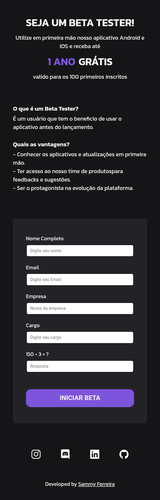
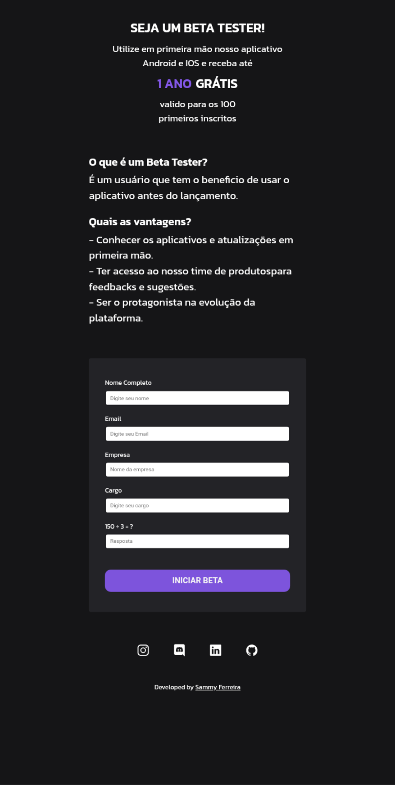

<h1 align="center"> Subscription Test Beta </h1>

 
 
    <a href="#-acesso-ao-projeto">Acesso ao projeto</a>&nbsp;&nbsp;&nbsp;|&nbsp;&nbsp;&nbsp; 
    <a href="#-tecnologias-utilizadas">Tecnologias utilizadas</a>&nbsp;&nbsp;&nbsp;|&nbsp;&nbsp;&nbsp;
    <a href="#-preview">Preview</a>&nbsp;&nbsp;&nbsp;|&nbsp;&nbsp;&nbsp;  
    <a href="#-links">Links</a> 
  

  
  
 
    
 
 
  
  
  
  ## 🖼️ Preview
  
  <h1 align="center">
  
  </h1>

  <h1 align="center">
  
  </h1>
  
  ## 📁 Acesso ao projeto
  
  Você pode acessar o [PROJETO](https://github.com/Sammyferreira1/ProjectSubscriptionBeta).
  
  ## ✔️ Tecnologias Utilizas
  
 - ``HTML`` 
 - ``CSS`` 

  ## 🧾 Resumo do projeto
  
  Live site URL :  [Subscription Test Beta](https://sammyferreira1.github.io/ProjectSubscriptionBeta/)
  
  Site feita para praticar HTML e CSS.